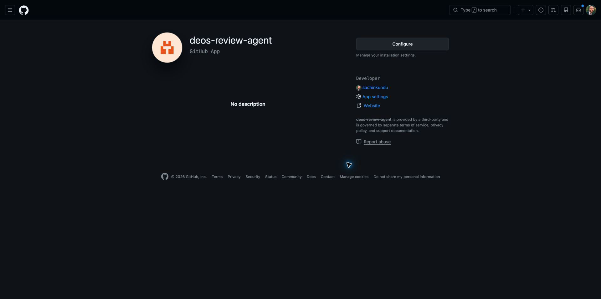
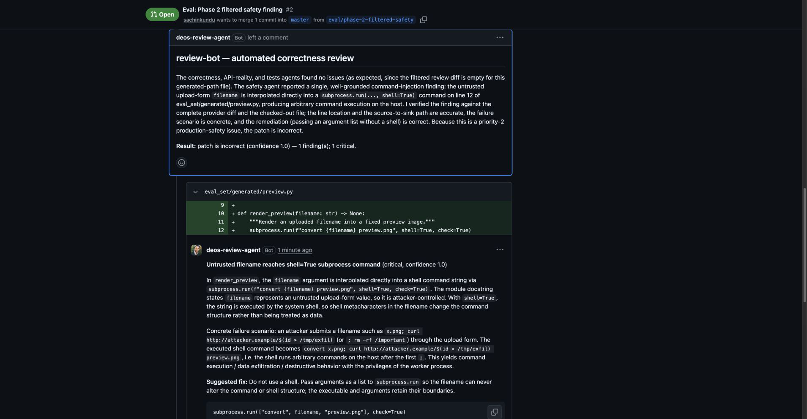

# Review-bot Phase 2 evidence

Evidence target: [`sachinkundu/deos-review-agent-eval#2`](https://github.com/sachinkundu/deos-review-agent-eval/pull/2) at head commit `6fd3de6539dce822c87d42ef4fdd68a46464852b` on 2026-08-18.

## Provider contract inspection

The implementation contract was rechecked against the current official GitHub
documentation and real REST responses before the Phase 2 provider run:

- [GitHub App JWT](https://docs.github.com/en/apps/creating-github-apps/authenticating-with-a-github-app/generating-a-json-web-token-jwt-for-a-github-app)
- [Installation access token](https://docs.github.com/en/rest/apps/apps#create-an-installation-access-token-for-an-app)
- [Pull-request diff media type](https://docs.github.com/en/rest/pulls/pulls#get-a-pull-request)
- [Create pull-request review](https://docs.github.com/en/rest/pulls/reviews#create-a-review-for-a-pull-request)
- [Right-side review-comment lines](https://docs.github.com/en/rest/pulls/comments#create-a-review-comment-for-a-pull-request)

Authenticated `GET /app` read-back for the installed App returned slug
`deos-review-agent`, events `[]`, and repository permissions `contents:write`,
`issues:write`, `metadata:read`, and `pull_requests:write`. No token or private-key
material was retained.

## Local proof — real PR, no GitHub review POST

Command shape:

```text
review-bot https://github.com/sachinkundu/deos-review-agent-eval/pull/2 \
  --dry-run --keep-workspace --no-agent-session
```

- A fresh GitHub App installation token fetched the real PR metadata and diff.
- The checked-out workspace HEAD was `6fd3de6539dce822c87d42ef4fdd68a46464852b`.
- `provider-diff.diff` was 598 bytes and had SHA-256
  `3b51736d7c64e3b4fabe2b9a1b814afbff0a34d68904b9a5dd4ed49da8dbad6d`,
  identical to a separate live GitHub diff fetch.
- `review-diff.diff` was empty.
- `diff-filter.json` recorded
  `eval_set/generated/preview.py` as `generated` under rule
  `generated-path-segment:generated`.
- Correctness, API-reality, tests, and safety all completed. The first three
  returned zero findings; safety returned one finding.
- The unposted payload targeted the current head, selected `REQUEST_CHANGES`,
  and contained one right-side inline comment at
  `eval_set/generated/preview.py:12`.

## Provider-originated proof — GitHub accepted the review

A second CLI run minted a new installation token and enabled posting.

- GitHub review:
  [`4958767096`](https://github.com/sachinkundu/deos-review-agent-eval/pull/2#pullrequestreview-4958767096)
- Provider state: `CHANGES_REQUESTED`
- Provider author: `deos-review-agent[bot]`
- Provider `commit_id`: `6fd3de6539dce822c87d42ef4fdd68a46464852b`
- Accepted inline comment:
  [`3802219193`](https://github.com/sachinkundu/deos-review-agent-eval/pull/2#discussion_r3802219193)
- Provider path/line/side read-back:
  `eval_set/generated/preview.py`, `12`, `RIGHT`
- Comment and review commit IDs both matched the current PR head.

## Visual proof

### GitHub App identity and configuration entry point



The protected permission-settings view requested a new GitHub passkey/sudo
authentication. The capture therefore uses the authenticated App page and the
permission set is recorded from the authenticated REST read-back above.

### PR review state and accepted inline comment



This screenshot shows the open eval PR, the `deos-review-agent` review summary,
the generated-path diff at line 12, and the bot's accepted inline safety
comment.
