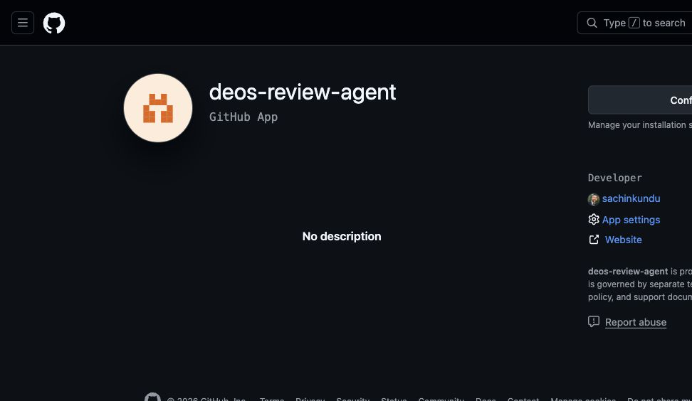
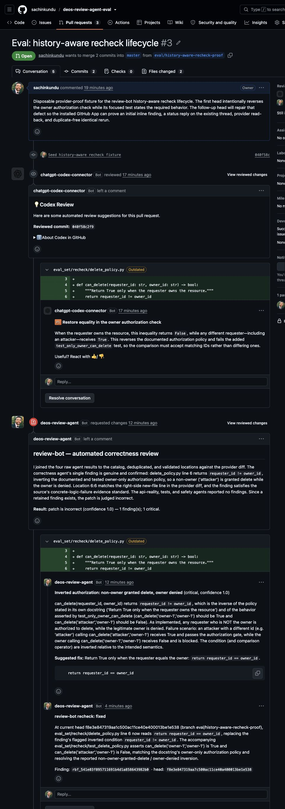
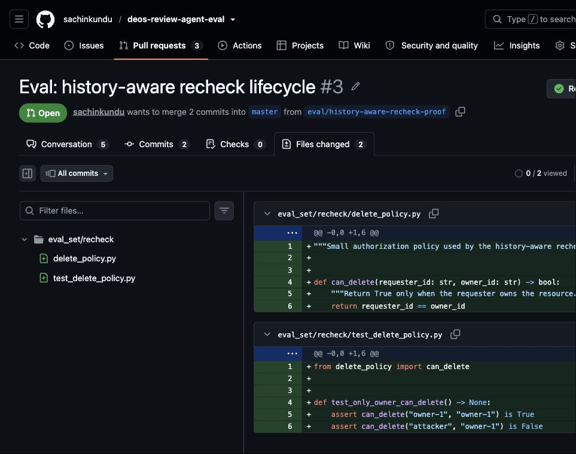

# History-aware recheck proof

Evidence target: [`sachinkundu/deos-review-agent-eval#3`](https://github.com/sachinkundu/deos-review-agent-eval/pull/3) on 2026-08-21.

The proof deliberately started with an inverted owner-only authorization check,
posted a real inline finding through the installed GitHub App, corrected the
code on a new head, posted a `fixed` reply to the existing top-level thread,
and repeated the same-head run to prove that no duplicate mutation is planned.

The redacted machine-readable facts are in [`proof-manifest.json`](proof-manifest.json).
No installation token, App private key, agent transcript, or model prompt is
retained here.

## Local proof — real PR, no GitHub mutation

The initial dry run targeted exact head
`040f58c2f91781b7853b837d8a85f9981f2b1fe9` and retained history digest
`sha256:6be2b6a52e0dd8380ccbcadbf6e67e0c930b86c04fb1e7c2218c0548ecaf419e`.
Its unposted payload requested changes with one right-side inline comment at
`eval_set/recheck/delete_policy.py:6`. Posting was skipped.

An earlier dry run at the same code head detected that provider history had
changed while the agents were running: expected digest `sha256:c95ab757...`
became `sha256:6be2b6a5...`. It stopped at the history-freshness guard with exit
code `5`, retained `stale-result.json`, and made no GitHub mutation.

After the fix, the recheck dry run targeted exact head
`f8e3e847319aa7c500ac11ce40a400013be1e538` and retained history digest
`sha256:4daf6a7cc028072647f8fb302ac2159b51ea03494a7f5dcad414d86d61f86350`.
All four reviewers and the coordinator succeeded. The closed-world plan
classified the sole pending finding as `fixed` and proposed exactly one reply
to provider comment `3828363742`. Posting was skipped.

## Provider-originated proof — GitHub accepted both lifecycle writes

The real `deos-review-agent[bot]` App created requested-changes review
[`4990960879`](https://github.com/sachinkundu/deos-review-agent-eval/pull/3#pullrequestreview-4990960879)
against the initial head. GitHub accepted inline comment
[`3828363742`](https://github.com/sachinkundu/deos-review-agent-eval/pull/3#discussion_r3828363742)
on `eval_set/recheck/delete_policy.py`, line `6`, side `RIGHT`, with both
`commit_id` and `original_commit_id` equal to that head. Provider read-back
bound it to stable finding ID `rbf_541e03f895711691b4d1a858643982b0`.

On the corrected head, the App posted exactly one verified `fixed` reply,
[`3828423255`](https://github.com/sachinkundu/deos-review-agent-eval/pull/3#discussion_r3828423255),
whose `in_reply_to_id` is the accepted top-level comment. Provider read-back
bound it to stable action ID `rba_119e2fcf5823b6eb37df8a7876222741`.
GitHub GraphQL read-back reports thread `PRRT_kwDOT6wBGc6bE-4d` as unresolved,
so the bot did not resolve the reviewer's thread.

An identical-head rerun selected `no-op` in 3.519 seconds and skipped workspace,
agents, coordination, validation, payload creation, posting, and cleanup. A
fresh provider read showed the App's review-comment count remained `2`, with
IDs `3828363742` and `3828423255` only.

## Visual proof

### GitHub App identity

The protected permission-settings view requires a fresh GitHub sudo/passkey
confirmation, so the capture uses the authenticated public App page. The proof
run itself authenticated as the installation and minted a fresh installation
token per CLI invocation.

### Initial review, fixed reply, and unresolved thread

This captures the App-authored requested-changes review, the accepted inline
finding, the App-authored fixed reply on the same conversation, and the still
available `Resolve conversation` control.

### Corrected current head

The current two-commit PR diff shows line 6 as
`return requester_id == owner_id` and the focused owner/non-owner assertions.
