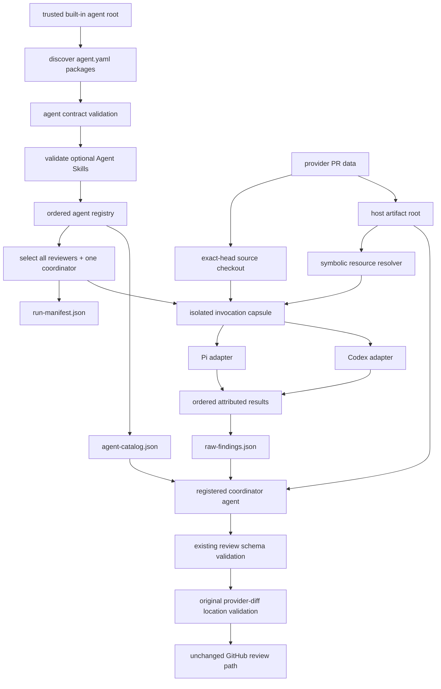

## Context

See `proposal.md` for motivation and the delta specs for required behavior. Phase 2 constructs four `AgentSpec` values in `review.py`, loads each role from a private Markdown prompt, and gives a coordinator prompt a hard-coded description of those four roles. `AgentSpec` already separates identity, instructions, and assigned inputs, but orchestration code remains the only source of the roster.

This design distinguishes two concepts:

- An **agent** is one independently executed review role. It has a registration manifest, its own prompt, declared inputs, output contract, and optionally several skills.
- A **skill** is a specialized capability available to one agent. Every skill uses the portable [Agent Skills `SKILL.md` specification](https://agentskills.io/specification) and its progressive-loading model. A skill is not independently scheduled and is not a review agent.

The [Agent Skills client guide](https://agentskills.io/client-implementation/adding-skills-support) defines native discovery, catalog disclosure, activation, and resource loading. Pi supports explicit `--skill <path>` loading with ambient discovery disabled, while [Codex discovers Agent Skills from configured roots](https://developers.openai.com/codex/skills/). The runner must use those mechanisms when an agent has skills; it must not paste skill bodies into the prompt.

The pull-request checkout and ambient user configuration are untrusted inputs to a review run. Agents and their skills must already be discovered, validated, and fixed before the pull request is inspected. Host-produced review artifacts must also remain separate from the checked-out source so a filtered reviewer does not gain the complete provider diff by walking the repository.

## Goals / Non-Goals

**Goals:**

- Represent every built-in reviewer and the coordinator as a self-contained agent package with a prompt and zero or more optional Agent Skills.
- Let the trusted host discover and validate agent packages without a Python roster.
- Let the coordinator discover the selected run roster from generated catalog data rather than a role list embedded in its prompt.
- Preserve explicit least-privilege inputs, a shared output schema, deterministic artifacts, partial failures, and bounded parallelism.
- Load an agent's application-provided skills natively in Pi and Codex while
  excluding target-repository, user, and container-admin skills. Treat
  provider-bundled system skills as part of the trusted harness binary.
- Keep the exact source checkout separate from all host-created diffs, manifests, results, and invocation capsules.

**Non-Goals:**

- Converting agents into skills or requiring an agent to have a skill.
- Loading third-party, user-installed, target-repository, or remote agents or skills.
- Selecting a subset by risk, cost, path, or diff size; the initial policy selects every registered reviewer.
- Making Agent Skills `allowed-tools` authoritative for sandbox or process permissions.
- Generalizing the reviewers-then-coordinator pipeline into an arbitrary dependency graph.
- Changing role semantics while migrating the Phase 2 prompts.

## Components

```text
review_bot/agents/
  registry.py
  runner.py
  harnesses/
    pi.py
    codex.py
  builtin/                              trusted agent registry root
    correctness/
      agent.yaml
      prompt.md
      coordinator-policy.md
      skills/                           optional; may be empty
        <skill-name>/SKILL.md
    api-reality/
      agent.yaml
      prompt.md
      coordinator-policy.md
      skills/<skill-name>/SKILL.md
    tests/
      agent.yaml
      prompt.md
      coordinator-policy.md
    safety/
      agent.yaml
      prompt.md
      coordinator-policy.md
    coordinator/
      agent.yaml
      prompt.md
      skills/<skill-name>/SKILL.md       optional

review.py
  |
  +--> workspace.py -------------------> exact-head source checkout only
  +--> artifact_store.py --------------> host diff/context/result root
  +--> agents/registry.py -------------> validated AgentDefinition values
  +--> resource_resolver.py -----------> symbolic resource assignments
  +--> agents/harnesses/*.py ----------> isolated native harness invocation
  +--> agents/runner.py ---------------> bounded reviewers + AgentResult
  +--> coordinator.py -----------------> catalog + results + coordinator agent
  `--> run-manifest.json --------------> discovery/selection audit
```

The agent package contract is review-bot-specific because coding harnesses schedule processes, not abstract Agent Skills. Only the optional directories beneath each package's `skills/` folder use the Agent Skills standard.

## Runtime layout

```text
<workspace-root>/<owner>/<repo>/<pr>/<head>/
  source/                               exact checked-out repository
  host-artifacts/                       never inside source/
    provider-diff.diff
    review-diff.diff
    diff-filter.json
    shared-context.md
    run-manifest.json
    agent-catalog.json
    raw-findings.json

<separate-temporary-root>/<invocation-id>/
  repository -> .../source              clean source view, no host artifacts
  input-manifest.json
  inputs/                               copies or contained links for assigned inputs only
  .agents/skills/                       Codex adapter only; this agent's skills only
```

Invocation capsules use a separate temporary root rather than a child of `host-artifacts/`. An agent sees the source checkout and only the host resources named in its validated input assignment. The checkout may itself contain repository-owned `.agents/skills`, but harness discovery is based on the isolated capsule and those target skills are never trusted or loaded.

## Data flow



1. Scan only configured application-owned roots for direct child directories containing `agent.yaml`.
2. Strictly validate each agent manifest and every contained prompt, policy, and optional Agent Skill before fetching or inspecting the pull request.
3. Require exactly one coordinator and at least one reviewer. Sort reviewers by `(order, name)` and reject duplicate agent names.
4. Compute a deterministic package digest over the manifest, prompt, coordinator policy, and all bundled skill files. Write discovered and selected definitions to `run-manifest.json`.
5. Fetch the real pull request and place the exact checkout under `source/`. Write every host-created diff and context artifact under the sibling `host-artifacts/` directory.
6. Resolve symbolic resources such as `pr-context`, `review-diff`, `provider-diff`, `agent-catalog`, and `raw-findings`. Agent manifests never supply filesystem paths for review inputs.
7. Build a separate invocation capsule for each reviewer containing its prompt assignment, clean `repository` view, and only its declared host resources. Load zero or more package skills through the selected harness's native mechanism.
8. Run reviewers through a bounded pool. Preserve results in registry order and carry source agent name, validated contract version, and package digest on each result envelope.
9. Generate `agent-catalog.json` from selected reviewer definitions and coordination policies. Invoke the registered coordinator agent with the catalog, raw results, shared context, and complete provider diff.
10. Keep the existing output-schema validation, provider-diff location validation, head-SHA check, and GitHub review behavior.

## Agent package contract

```yaml
version: review-bot/v1
name: safety
kind: reviewer
description: Finds concrete hardcoded-secret exposure and injection paths.
prompt: prompt.md
inputs:
  - pr-context
  - provider-diff
output_schema: review-result/v1
order: 40
coordinator_policy: coordinator-policy.md
```

The coordinator uses kind `coordinator`, omits `coordinator_policy`, and declares `pr-context`, `agent-catalog`, `raw-findings`, and `provider-diff`. A prompt is required for every agent. The optional `skills/` directory is discovered recursively for Agent Skills directories, then ordered by standards-valid skill name. The agent prompt may explicitly invoke one or more of those skills, or the harness may activate a skill when its description matches; prompt-only agents remain valid.

Runtime controls are deliberately absent from `agent.yaml`. Model, thinking level, timeout, maximum concurrency, tool set, sandbox, credentials, and GitHub posting authority remain operator-owned configuration.

## Minimal data model

```python
@dataclass(frozen=True)
class AgentSkill:
    name: str
    skill_dir: Path
    digest: str


@dataclass(frozen=True)
class AgentDefinition:
    name: str
    kind: Literal["reviewer", "coordinator"]
    contract_version: Literal["review-bot/v1"]
    description: str
    package_dir: Path
    prompt: Path
    inputs: tuple[InputResource, ...]
    output_schema: Literal["review-result/v1"]
    order: int
    coordinator_policy: Path | None
    skills: tuple[AgentSkill, ...]
    package_digest: str


class InputResource(StrEnum):
    PR_CONTEXT = "pr-context"
    REVIEW_DIFF = "review-diff"
    PROVIDER_DIFF = "provider-diff"
    AGENT_CATALOG = "agent-catalog"
    RAW_FINDINGS = "raw-findings"


@dataclass
class AgentResult:
    name: str
    contract_version: str
    package_digest: str
    ok: bool
    output: dict | None = None
    error: str | None = None
    duration_seconds: float = 0.0
```

`agent-catalog.json` carries enough validated data for generic coordination:

```json
{
  "contract": "review-agent-catalog/v1",
  "agents": [
    {
      "name": "safety",
      "contract_version": "review-bot/v1",
      "package_digest": "sha256:...",
      "description": "Finds concrete hardcoded-secret exposure and injection paths.",
      "skills": ["shell-injection-analysis"],
      "status": "selected",
      "coordinator_policy": "Retain only ..."
    }
  ]
}
```

`raw-findings.json` repeats `name`, `contract_version`, and `package_digest` on every result envelope. Each attributed finding retains `source_agent`. The coordinator rejects any result that cannot be joined exactly to the catalog on all three identity fields.

## Decisions

### 1. Register agents; attach standards-compliant skills

The custom `agent.yaml` describes what the host schedules. `prompt.md` remains the agent's primary role instruction. Optional `skills/<name>/SKILL.md` packages add portable capabilities and remain independently usable by any Agent Skills-compatible harness.

Alternative considered: make each review agent a `SKILL.md`. Rejected because an agent is an independently executed actor with inputs, output, ordering, and failure state, whereas a skill is on-demand instruction and resources available inside an agent session. Equating them prevents prompt-only agents and obscures the useful case where one agent has several skills.

### 2. Discover with the host; disclose the selected roster to the coordinator

The deterministic host scans, validates, selects, and schedules. The coordinator is itself a registered agent, but it learns the reviewer roster from `agent-catalog.json`; it does not scan the filesystem or launch reviewers. This provides dynamic coordination without making model behavior responsible for permissions, execution, or failure accounting.

Alternative considered: ask the coordinator model to scan and launch agent folders. Rejected because malformed definitions could enter context before validation and the effective roster would be nondeterministic.

### 3. Fail closed on agent and skill definitions

Validate `agent.yaml` against the review-bot schema. Validate each optional skill with a pinned Agent Skills reference validator and enforce package containment after symlink resolution. Duplicate agents, unsupported resources, invalid skill names, escaping paths, and incorrect coordinator cardinality stop the run before any model starts.

The package digest covers every regular file under the agent directory in normalized relative-path order, framed with path and byte length before content. Symlinks are allowed only when the fully resolved target remains inside the package. This makes prompts, policies, scripts, references, assets, and Agent Skills instructions part of the agent's audit identity.

Alternative considered: accept the lenient behavior of each harness. Rejected because Pi and Codex have different collision and validation behavior, which would make registration harness-dependent.

### 4. Resolve named resources and separate host artifacts from source

`PRWorkspace` gains distinct `source_dir` and `artifact_dir` locations. Clone, checkout, and bootstrap operate only in `source_dir`. Provider diff, filtered diff, filter manifest, shared context, catalogs, results, and payload evidence are written only to `artifact_dir`.

The registry accepts only approved symbolic inputs. A resolver copies or exposes only assigned artifacts in an invocation capsule. Correctness, API-reality, and tests receive `review-diff`; safety receives `provider-diff`; the coordinator receives catalog, results, shared context, and provider diff. All agents may inspect the clean source checkout for code context, but no host-created review artifact exists below that checkout.

Alternative considered: keep artifacts in the source checkout and omit unassigned names from the prompt. Rejected because an agent could discover `repository/provider-diff.diff` directly and bypass the filtered assignment.

### 5. Use isolated native Agent Skills loading per harness

For Pi, pass the agent prompt through its normal prompt mechanism, add `--no-skills`, and add one `--skill <trusted-path>` argument for each optional skill. No skill arguments are needed for a prompt-only agent.

For Codex, create clean temporary `HOME` and `CODEX_HOME` directories for every invocation. Forward only the minimum authentication material supported by the installed Codex version into the temporary `CODEX_HOME`, with restrictive permissions; never preserve or link the real `CODEX_HOME` because it may contain ambient skills, plugins, configuration, or other instructions. Use the documented `--ignore-user-config` and `--ignore-rules` flags, stage only this agent's optional application skills under the capsule's `.agents/skills`, launch from the capsule with a read-only sandbox, and clean up authentication material and the capsule after output capture. The controlled Cloudflare Sandbox image must not contain Codex admin skills under `/etc/codex/skills`; adapter verification fails closed if it does. OpenAI-bundled system skills cannot be removed through the local skill scopes and are therefore an explicit trusted capability of the selected Codex binary, not part of the application agent registry.

Both adapters give the model the agent prompt plus `input-manifest.json`. They do not inline `SKILL.md`. If the prompt explicitly names a bundled skill, the harness activates it using its native syntax; otherwise normal Agent Skills description matching applies. Implementation must prove the exact real Pi and Codex command contract, including the effective skill catalog, before an adapter is accepted.

Alternative considered: preserve the real `CODEX_HOME` while isolating only `HOME`. Rejected because current Codex still discovers skills from `CODEX_HOME`, so ambient user or system skills would enter the review invocation.

### 6. Separate registration, selection, scheduling, and coordination

Registration returns all valid definitions. A small selection interface initially returns every reviewer and the singleton coordinator. A future risk-tier change can replace that policy without changing agent discovery or package structure. Scheduling uses `min(selected_reviewers, REVIEW_MAX_AGENT_CONCURRENCY)` workers, with a default bound of four. Results serialize in registry order.

The coordinator runs after reviewers. Its catalog includes every reviewer's description, contract version, package digest, optional skill names, and coordination policy. Per-agent policy is data; global deduplication, one-issue-per-finding, location checks, severity, verdict, and noise bias remain in the coordinator prompt.

Alternative considered: treat registration as implicit unbounded execution. Rejected because plugin count must not determine peak local process count.

### 7. Migrate current semantics before adding skills or roles

Correctness, API-reality, tests, safety, and coordinator first move into agent packages with content-equivalent prompts and no requirement to invent skills. Deterministic fixtures prove prompt-only agents work. Separate fixtures with one and multiple Agent Skills prove native catalog loading. A fifth reviewer fixture demonstrates that no coordinator or orchestration source edit is required.

Alternative considered: create new production skills during migration. Rejected because simultaneous semantic and architectural changes would make regressions harder to attribute.

## Failure modes

| Failure | Handling |
|---|---|
| Registry root is missing or contains no reviewers | Fail before pull-request inspection, runner construction, or GitHub posting. |
| Zero or multiple coordinator agents exist | Fail registry validation and report every conflicting path. |
| Agent manifest, prompt, or policy is invalid | Fail closed with the owning package and diagnostic. |
| Bundled `SKILL.md` violates Agent Skills | Fail closed with the owning agent, skill path, and reference-validator diagnostic. |
| Duplicate agent name or invalid symbolic input | Fail before resolving workspace paths. |
| Declared file or symlink escapes the agent package | Fail validation before computing the registry result. |
| Agent package changes after discovery | Recompute before launch and fail if its digest differs from the run manifest. |
| Host artifact appears under `source/` | Fail workspace validation before starting agents. |
| Invocation contains an unassigned host artifact | Fail capsule validation before starting that agent. |
| Pi or Codex exposes a user, container-admin, or target skill | Treat adapter verification as failed and do not accept the run as valid evidence. |
| Codex authentication cannot be forwarded without the real home | Fail the Codex adapter; do not fall back to exposing the real `CODEX_HOME`. |
| Selected count exceeds concurrency | Queue excess reviewers; never silently omit them. |
| One or more reviewers fail | Preserve Phase 2 partial-failure behavior and pass all records to the coordinator. |
| All reviewers fail | Stop before coordinator and GitHub posting. |
| Result identity does not match name, contract version, and digest in catalog | Fail coordination before posting. |
| Coordinator agent fails or returns invalid output | Stop before posting, retaining existing coordinator failure semantics. |

## Risks / Trade-offs

- **A private agent manifest is another contract to maintain.** → Keep it small, version it explicitly, and use Agent Skills only for the capability layer it actually standardizes.
- **Harness Agent Skills behavior can drift between releases.** → Capability-probe the installed Pi and Codex command contracts, inspect effective catalogs with real harnesses, and fail unsupported adapters explicitly. Provider-bundled Codex system skills remain inside the trusted harness boundary.
- **Minimal Codex authentication forwarding is version-sensitive.** → Isolate it behind the Codex adapter, test the supported auth source, apply restrictive permissions, and never copy configuration or skill roots.
- **Separating source and artifacts changes workspace paths.** → Introduce explicit `source_dir` and `artifact_dir` properties, keep code locations repository-relative, and regression-test cleanup and retained-workspace behavior.
- **Strict validation rejects skills a lenient client might accept.** → Built-in production agents are controlled source; require standards-valid packages and run `skills-ref` before merge.
- **More registered reviewers increase total latency and cost.** → Keep selection separate from discovery and bound concurrency; risk-based selection remains later scope.
- **Prompt migration can accidentally change review behavior.** → Perform a content-equivalent move first and compare deterministic plus real-harness outputs before adding production skills.

## Migration Plan

1. Add the agent manifest schema, registry model, package containment and digest checks, Agent Skills validation, symbolic resource resolver, and generated manifest/catalog schemas.
2. Split the review workspace into an exact-head `source/` checkout and sibling `host-artifacts/`; assert no host artifacts are written beneath source.
3. Move correctness, API-reality, tests, safety, and coordinator prompts into content-equivalent built-in agent packages. Leave `skills/` empty initially unless a genuine reusable capability is identified.
4. Add isolated Pi and Codex adapters. Prove prompt-only, one-skill, and multiple-skill agents; native activation; clean Codex `HOME` and `CODEX_HOME`; and exclusion of ambient, target, and unassigned artifacts using real installed harnesses.
5. Replace fixed `AgentSpec` construction and coordinator role text with registry discovery, select-all policy, bounded scheduling, identity-bearing result envelopes, and catalog-driven coordination.
6. Run the full deterministic suite, then run both harness adapters locally against a real pull request without posting. Retain source/artifact separation, run manifest, catalog, raw results, effective skill catalogs, and unposted payload as local proof.
7. Run the real GitHub App on a controlled pull request only if posting-path regression evidence is needed. Label it provider-originated proof and retain accepted review plus line read-back separately from harness-local proof.

Rollback is a source revert to the Phase 2 fixed roster, top-level prompt files, and single workspace directory. No persistent data migration, provider configuration, or credential change is introduced.
