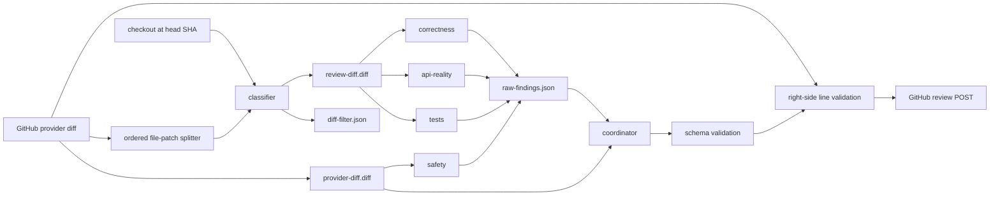

## Context

See `proposal.md` for the approved motivation and scope. Phase 1 already fetches one
provider-originated GitHub diff, checks out the exact PR head SHA, writes shared review
context, runs correctness and API-reality agents concurrently, coordinates their
structured outputs, validates final locations against the provider diff, and posts one
review.

Phase 2 adds two agents and two views of the same diff. Correctness, API-reality, and
tests review need a deterministic low-noise view. Safety review must retain visibility
into every provider patch because generated, vendored, and lock files can still expose
secrets or injection paths. Location validation and GitHub posting must also continue to
use the complete provider diff. The approved requirements define the exact exclusion
rules and precedence; this design does not introduce a risk classifier or conditional
agent roster.

The implementation remains a local Python CLI. Its existing GitHub App authentication,
fresh installation token, head-SHA freshness check, and review payload behavior are not
changed by this phase.

## Goals / Non-Goals

**Goals:**

- Derive reproducible full and filtered diff artifacts from one provider response.
- Make each agent's assigned diff explicit in the pipeline instead of relying on a
  filename convention inside an agent runner.
- Run correctness, API-reality, tests, and safety concurrently on every review and keep
  Phase 1 partial-failure behavior.
- Preserve enough classification evidence for an operator to reproduce every omitted
  file decision.
- Keep coordinator output on the existing shared schema and validate every final
  location against the complete provider diff.

**Non-Goals:**

- Selecting agents by diff size, path, exclusion result, or inferred risk.
- Expanding safety review beyond hardcoded secrets and obvious injection paths.
- Adding coverage scoring, test generation, or automatic fixes.
- Adding hosted execution, webhooks, cross-run persistence, or a new GitHub payload.
- Changing how installation tokens, PR metadata, the target head SHA, or review comments
  are handled.

## Components

```text
review.py
  |
  +--> github.py --------------------> PR metadata + exact provider diff
  |
  +--> workspace.py -----------------> checkout exact head SHA + bootstrap
  |
  +--> diff_filter.py
  |      +--> provider-diff.diff ----> complete provider diff text
  |      +--> review-diff.diff ------> retained file patches only
  |      +--> diff-filter.json ------> excluded path/category/rule records
  |
  +--> shared_context.py ------------> shared-context.md + artifact descriptions
  |
  +--> agents/runner.py (four concurrent AgentSpec values)
  |      +--> correctness -----------> review-diff.diff
  |      +--> api-reality -----------> review-diff.diff
  |      +--> tests -----------------> review-diff.diff
  |      +--> safety ----------------> provider-diff.diff
  |
  +--> coordinator.py ---------------> raw-findings.json + provider-diff.diff
  |
  +--> schema.py ---------------------> shared structured-output validation
  |
  +--> diff_validator.py ------------> complete in-memory provider diff
  |
  `--> github.py ---------------------> unchanged review POST at fetched head SHA
```

| Component | Phase 2 responsibility |
|---|---|
| `diff_filter.py` | Split the provider diff into ordered file patches, classify each path, inspect eligible right-side files for generated markers, and write the three diff artifacts. |
| `shared_context.py` | Describe both diff views and the manifest without representing filtered files as absent from the PR. |
| `agents/runner.py` | Accept an explicit agent name, prompt, and input filenames; attach only those inputs to a run. |
| `prompts/tests.md` | Request only concrete, changed-behavior regression gaps or ineffective assertions. |
| `prompts/safety.md` | Request only evidence-backed hardcoded-secret exposures or source-to-sink injection paths. |
| `prompts/coordinator.md` | Coordinate findings from all four named agents and verify them against the full provider view. |
| `review.py` | Build artifacts, declare the fixed four-agent roster, preserve partial failures, and report all four roles accurately in the summary. |

## Data flow



1. Fetch PR metadata and the complete diff once with the freshly minted installation
   token, then check out the fetched `head_sha`.
2. Write the returned diff text unchanged to `provider-diff.diff` and split it into ordered file
   sections without normalizing their patch text.
3. Classify each right-side path. Path and basename rules use metadata only; the
   generated-marker rule reads the checked-out right-side file at the same head SHA.
4. Concatenate every retained raw file section, in provider order, into
   `review-diff.diff`. Record every excluded path once in `diff-filter.json`.
5. Write shared context that lists all provider-reported changed files and explains the
   assigned diff artifacts.
6. Start the fixed four-agent roster concurrently. An empty filtered diff does not skip
   correctness, API-reality, or tests; those agents still receive shared context and an
   empty `review-diff.diff`. Safety always receives the complete diff.
7. Write all successful results and all failure records to `raw-findings.json`. If at
   least one agent succeeds, run the coordinator with the raw findings and complete
   provider diff. If every agent fails, retain the existing no-post failure.
8. Validate coordinator output with the shared schema, then validate every location
   against the original in-memory provider diff. Re-check `head_sha` and post through
   the unchanged GitHub client.

## Minimal data model

The provider diff remains the source of truth. Phase 2 adds local orchestration types;
it does not change the review JSON schema or GitHub payload.

```python
@dataclass(frozen=True)
class DiffExclusion:
    path: str
    category: Literal["lockfile", "vendored", "generated"]
    rule: str  # stable rule identifier, not free-form prose

@dataclass(frozen=True)
class DiffArtifacts:
    provider_diff: Path
    review_diff: Path
    filter_manifest: Path
    exclusions: tuple[DiffExclusion, ...]

@dataclass(frozen=True)
class AgentSpec:
    name: Literal["correctness", "api-reality", "tests", "safety"]
    prompt: str
    input_files: tuple[str, ...]
```

The manifest is deterministic JSON with a version and provider-order exclusions:

```json
{
  "version": 1,
  "exclusions": [
    {
      "path": "web/dist/app.min.js",
      "category": "generated",
      "rule": "generated-path-segment:dist"
    }
  ]
}
```

Stable rule identifiers encode the exact match, for example
`lockfile-basename:uv.lock`, `vendored-path-segment:vendor`,
`generated-filename:*.pb.go`, or `generated-marker:generated+do-not-edit`.
The manifest follows the existing review-workspace lifecycle: it is available alongside
the other run artifacts, and `--keep-workspace` retains it for later inspection. Phase 2
does not add an external artifact store.

## Decisions

### 1. Preserve two named diff artifacts from one provider response

`provider-diff.diff` is written from the exact diff text returned by the GitHub client and is never
filtered. `review-diff.diff` contains only complete retained file sections, in their
original order and with their patch text unchanged. The implementation also keeps the
original response in memory for final line validation, so validation cannot accidentally
switch to the filtered view.

Alternative considered: overwrite the existing diff file after classification and
re-fetch the full diff before posting. Rejected because a second fetch could observe a
different PR head and would make the proof chain harder to audit.

### 2. Split raw file sections separately from line validation

Add a small ordered splitter in `diff_filter.py` that uses `diff --git` boundaries and
reuses the existing diff parser to identify each canonical right-side path. It retains
the raw section text for serialization. The proven right-side line parser remains the
posting validator rather than being rewritten as part of filtering.

Alternative considered: extend `FileDiff` into a combined parser, classifier, serializer,
and validator. Rejected because it couples a new input-reduction feature to the
provider-critical comment-location logic and increases regression risk.

### 3. Implement classification as ordered pure rules

For each normalized path, classification stops at the first matching category:

1. exact, case-sensitive basename in the approved lockfile set;
2. complete, case-sensitive normalized path segment in the approved vendored set;
3. approved generated path segment, then case-sensitive basename glob, then generated
   marker in the first 20 non-blank right-side file lines.

Path separators are normalized to `/` only for matching; the manifest retains the
canonical provider right-side path. Raw diff sections are not rewritten. Basename globs
use case-sensitive `fnmatchcase` semantics. Marker text uses case-insensitive ASCII-byte
comparison exactly as specified, so arbitrary or binary blob content does not create a
decoding-dependent result. Marker inspection reads the right-side Git blob at the
checked-out head SHA, so it neither follows a worktree symlink nor reads outside the
repository, and streams only until 20 non-blank lines have been considered. A path
without an inspectable regular blob, such as a gitlink, has no file-content marker to
match. An unexpected blob read failure stops artifact construction instead of silently
making a different classification decision.

Alternative considered: use GitHub Linguist or repository-specific `.gitattributes`.
Rejected because those inputs are mutable and would not implement the fixed,
cross-repository contract approved in the specs.

### 4. Make input files explicit in `AgentSpec`

Change the runner contract so orchestration supplies input filenames per invocation.
Correctness, API-reality, and tests receive `shared-context.md` plus
`review-diff.diff`. Safety receives `shared-context.md` plus `provider-diff.diff`.
The coordinator receives `shared-context.md`, `raw-findings.json`, and
`provider-diff.diff`. Both Pi and Codex runners consume the same declared inputs, even
though their CLI mechanics differ.

Alternative considered: select the diff by checking the agent name inside each runner.
Rejected because hidden role-to-file coupling makes the safety boundary easy to break
when agents are renamed or added.

### 5. Keep one shared schema and add focused prompts

Tests and safety use the existing output schema, shared finding rules, schema repair,
confidence values, priorities, verdict, and status. Their role prompts narrow the
permitted findings to the approved categories. Shared prompt text describes an
"assigned diff" rather than claiming every agent reads the same full diff. The
coordinator prompt names all four sources, preserves API-reality citations, enforces the
tests and safety evidence boundaries, and verifies candidate locations against the
complete provider diff.

Alternative considered: create role-specific JSON schemas. Rejected because the
coordinator and GitHub posting path benefit from one stable contract, and the required
differences are semantic prompt constraints rather than structural fields.

### 6. Use the existing concurrency and partial-failure model for four agents

Declare the roster in fixed order—correctness, API-reality, tests, safety—and submit all
four specs to the same bounded thread pool. Result ordering remains roster ordering for
deterministic raw artifacts. Every valid result, including a valid empty findings list,
is written to coordinator input. Individual failures are named in both the raw artifact
and review summary; only an all-agent failure stops before coordination.

Alternative considered: run safety first or skip ordinary agents when the filtered diff
is empty. Rejected because both approaches introduce scheduling or selection behavior
that the Phase 2 requirements explicitly exclude.

### 7. Keep classification audit data local and separate from model inputs

Write `diff-filter.json` beside the other run artifacts, but do not attach it to review
agent or coordinator invocations. This lets operators reproduce omissions without
spending model context on deterministic metadata or encouraging agents to second-guess
the filter.

Alternative considered: include exclusions in `shared-context.md`. Rejected because the
manifest is an operator audit record, while agents only need their assigned diff and the
complete changed-file list already present in shared context.

## Failure modes

| Failure | Handling |
|---|---|
| Provider diff cannot be split into attributable file sections | Fail before agents run or GitHub is called; do not silently omit an unparsed section. |
| A path matches several exclusion rules | Record only the first category under lockfile, vendored, generated precedence and the first matching rule within that category. |
| Right-side path is a gitlink rather than an inspectable file blob | It has no marker match and remains visible unless a preceding metadata rule matched. |
| An expected right-side blob cannot be read for marker inspection | Fail artifact construction before agents run rather than silently make a different classification decision. |
| Filtered diff is empty | Run correctness, API-reality, and tests with an empty file; run safety with the complete provider diff. |
| Filter artifact write fails | Stop before agents run so no agent receives an ambiguous or partial input set. |
| Tests or safety output is invalid | Record that agent as failed and continue with every valid agent result. |
| One to three agents fail | Name each failure in the review summary and coordinate all successful results. |
| All four agents fail | Exit without coordination or GitHub posting, retaining existing behavior. |
| Coordinator drops an agent result accidentally | Deterministic tests assert all successful named results, including empty ones, are present in `raw-findings.json`; coordinator prompt names all four roles. |
| A safety finding targets a file filtered for other agents | Coordinate it against `provider-diff.diff`, then validate and post it against the original provider diff. |
| Provider head changes before posting | Preserve the Phase 1 freshness check and refuse to post; a rerun mints a new installation token and rebuilds both diff views. |

## Risks / Trade-offs

- **Fixed rules can hide a relevant correctness or tests issue in a classified file.** →
  Keep the rules narrow and deterministic, preserve the full diff for safety and final
  validation, and expose every omission in the manifest.
- **Marker inspection reads untrusted repository content.** → Read the exact Git blob at
  the checked-out head SHA, stop after 20 non-blank lines, and never follow or execute
  file content.
- **A filtered unified diff could become malformed at file boundaries.** → Preserve
  entire raw file sections and their order; test mixed new, deleted, renamed, binary,
  quoted-path, and no-final-newline diffs.
- **Four concurrent model processes increase peak local resource use.** → Keep the pool
  bounded to the fixed roster and retain the existing per-agent timeout and isolated
  failure handling.
- **The coordinator may apply one role's standards to another role.** → Attribute every
  raw finding and state tests, safety, correctness, and API-reality acceptance rules
  separately in the coordinator prompt.
- **The manifest disappears under normal workspace cleanup.** → Keep its lifecycle
  consistent with other local run artifacts and document `--keep-workspace` as the
  operator path for retained audit inspection; cross-run persistence remains a later
  concern.

## Migration Plan

1. Add deterministic filter classification, raw-section serialization, manifest, prompt,
   runner-input, and four-agent orchestration tests. Include precedence, exact casing,
   separator normalization, marker window, empty filtered diff, and safety-on-filtered-file
   cases.
2. Update CLI summaries and documentation from the Phase 1 two-agent wording to the
   fixed four-agent Phase 2 behavior without changing authentication or posting APIs.
3. Run `ruff`, `pyright`, and the full `pytest` suite, then run the CLI with `--dry-run`
   against a real GitHub PR. Inspect the provider diff, filtered diff, manifest, all four
   raw agent records, and final payload. This is local proof only.
4. Run the real GitHub App against a controlled real PR using a newly minted installation
   token. Confirm that all four agents ran, a safety finding can survive filtering of the
   same file for other agents, the review targets the current `head_sha`, and every inline
   comment maps to a right-side line GitHub accepts. This is the provider-originated proof.
5. Capture screenshots of the GitHub App configuration, PR review state, and accepted
   inline comments for the implementation PR. Keep local, provider-originated, and visual
   evidence labeled separately.

Rollback is a source rollback to the Phase 1 implementation. No stored provider data or
remote migration is introduced. Existing credentials remain valid, and every rerun mints
a new short-lived installation token.
