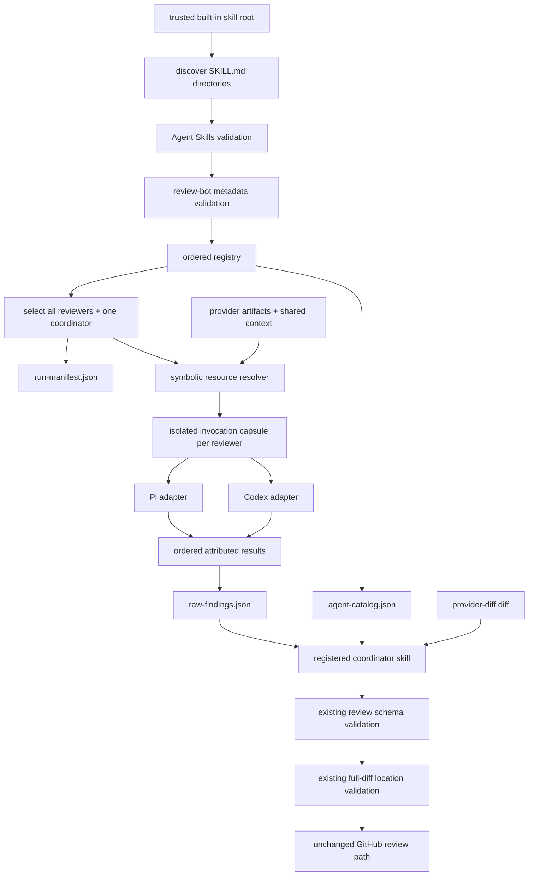

## Context

See `proposal.md` for motivation and the two delta specs for required behavior. Phase 2 constructs four `AgentSpec` values in `review.py`, loads each role from a private Markdown prompt, and gives a coordinator prompt a hard-coded description of those four roles. `AgentSpec` already separates identity, instructions, and assigned input files, but the host remains the only source of the roster and role-to-input mapping.

The [Agent Skills specification](https://agentskills.io/specification) defines a portable directory containing `SKILL.md` plus optional `scripts/`, `references/`, and `assets/`. Its `metadata` field permits string-valued client extensions. The [client integration guide](https://agentskills.io/client-implementation/adding-skills-support) defines discovery, catalog disclosure, activation, and progressive loading. Both current harnesses are listed Agent Skills clients: Pi supports `--no-skills` with repeatable `--skill <path>`, while [Codex discovers repository and user Agent Skills](https://developers.openai.com/codex/skills/) and supports symlinked skill directories.

The pull-request checkout is untrusted. A review run therefore cannot rely on normal project-level discovery from that checkout, and it cannot expose ambient user skills. The application must choose the trusted skill package and give the harness an isolated catalog. GitHub authentication, diff provenance, head freshness, and posting remain outside this change.

## Goals / Non-Goals

**Goals:**

- Make every built-in reviewer and the coordinator a self-contained Agent Skills-standard package.
- Let a deterministic trusted host discover and validate the available agent set without a source-code roster.
- Let the coordinator discover the selected run roster from generated data rather than a role list embedded in its instructions.
- Preserve explicit least-privilege inputs, a shared output schema, deterministic artifacts, partial failures, and bounded parallelism.
- Use native skill loading and activation in Pi and Codex while excluding untrusted and ambient skills.

**Non-Goals:**

- Loading third-party, user-installed, target-repository, or remote skills.
- Selecting a subset by risk, cost, path, or diff size; the initial selection policy returns all registered reviewers.
- Making Agent Skills `allowed-tools` authoritative for sandbox or process permissions.
- Generalizing the linear reviewers-then-coordinator pipeline into an arbitrary dependency graph.
- Changing role semantics while migrating the Phase 2 prompts.

## Components

```text
review_bot/agent_skills/                 trusted packaged registry root
  correctness/
    SKILL.md
    references/coordinator-policy.md
  api-reality/
    SKILL.md
    references/coordinator-policy.md
  tests/
    SKILL.md
    references/coordinator-policy.md
  safety/
    SKILL.md
    references/coordinator-policy.md
  coordinator/
    SKILL.md

review.py
  |
  +--> agent_registry.py --------------> validated AgentDefinition values
  +--> resource_resolver.py -----------> symbolic resource assignments
  +--> harnesses/pi.py ----------------> native --skill invocation
  +--> harnesses/codex.py -------------> isolated .agents/skills catalog
  +--> agents/runner.py ---------------> bounded execution + AgentResult
  +--> coordinator.py -----------------> catalog + raw results + coordinator skill
  `--> run-manifest.json --------------> ordered discovery/selection audit
```

The package location is intentionally not the target checkout's `.agents/skills`. Each directory is still a complete portable Agent Skill; a harness adapter exposes the selected directory through its supported native mechanism at invocation time.

## Data flow



1. Scan only configured application-owned registry roots and locate directories containing `SKILL.md`.
2. Strictly validate Agent Skills frontmatter, then parse and validate the namespaced review-bot metadata.
3. Require exactly one coordinator and at least one reviewer. Sort reviewers by `(review-bot-order, name)` and reject duplicate names.
4. Compute a deterministic digest over each complete skill package in normalized relative-path order and write the discovered and selected entries to `run-manifest.json`.
5. Resolve symbolic resources such as `pr-context`, `review-diff`, `provider-diff`, `agent-catalog`, and `raw-findings` to host-owned paths. A skill never supplies an arbitrary path.
6. Create an isolated invocation capsule for each reviewer, expose only its assigned resources and repository view, and activate only that trusted Agent Skill through the selected harness.
7. Run selected reviewers through a bounded pool. Retain results in registry order, regardless of completion order, and write source skill identity plus digest on every result envelope.
8. Generate `agent-catalog.json` from selected reviewer definitions and coordinator-policy files. Run the registered coordinator skill with the catalog, raw results, shared context, and complete provider diff.
9. Keep the existing schema validation, provider-diff location validation, head-SHA check, and GitHub review behavior.

## Minimal data model

```python
@dataclass(frozen=True)
class AgentDefinition:
    name: str
    kind: Literal["reviewer", "coordinator"]
    skill_dir: Path
    inputs: tuple[InputResource, ...]
    output_schema: Literal["review-result/v1"]
    order: int
    coordinator_policy: Path | None
    digest: str


class InputResource(StrEnum):
    PR_CONTEXT = "pr-context"
    REVIEW_DIFF = "review-diff"
    PROVIDER_DIFF = "provider-diff"
    AGENT_CATALOG = "agent-catalog"
    RAW_FINDINGS = "raw-findings"


@dataclass(frozen=True)
class SelectedAgent:
    definition: AgentDefinition
    resource_paths: Mapping[InputResource, Path]


@dataclass
class AgentResult:
    name: str
    skill_digest: str
    ok: bool
    output: dict | None = None
    error: str | None = None
    duration_seconds: float = 0.0
```

The Agent Skills frontmatter remains standards-conformant. Review-bot extensions use only string-valued metadata:

```yaml
---
name: safety
description: Reviews a pull request for concrete hardcoded-secret exposure and injection paths. Use only as a review-bot safety reviewer.
metadata:
  review-bot-contract: "v1"
  review-bot-kind: "reviewer"
  review-bot-inputs: "pr-context provider-diff"
  review-bot-output-schema: "review-result/v1"
  review-bot-coordinator-policy: "references/coordinator-policy.md"
  review-bot-order: "40"
---
```

The coordinator uses kind `coordinator`, omits `review-bot-coordinator-policy`, and declares `pr-context agent-catalog raw-findings provider-diff`. `SKILL.md` contains the complete role instructions. Supporting role evidence guidance may live in references loaded progressively, while `references/coordinator-policy.md` contains the concise acceptance policy copied into the generated coordinator catalog.

`agent-catalog.json` contains only coordinator-relevant validated data:

```json
{
  "contract": "review-agent-catalog/v1",
  "agents": [
    {
      "name": "safety",
      "skill_digest": "sha256:...",
      "status": "selected",
      "coordinator_policy": "Retain only ..."
    }
  ]
}
```

`raw-findings.json` repeats the source name and digest on the result envelope and each finding. The coordinator rejects results that cannot be joined exactly to the catalog.

## Decisions

### 1. Use Agent Skills directories as the only role definition

Each built-in role moves from `review_bot/prompts/<role>.md` into a complete `review_bot/agent_skills/<name>/SKILL.md` package. The Agent Skills name is the stable agent identity. No parallel `agent.yaml` or Python roster is introduced.

Review-bot-specific fields live in the standard string-valued `metadata` extension point. They are deliberately narrow: kind, symbolic inputs, output contract, coordinator-policy reference, and order. Model, timeout, concurrency, tools, filesystem paths, and posting privileges remain operator-owned runtime policy.

Alternative considered: keep prompt files and add a custom manifest beside each. Rejected because the prompt would not itself be a portable skill, and harnesses could not natively discover or activate the role.

### 2. Discover with the host; disclose the selected roster to the coordinator

The deterministic host scans, validates, selects, and schedules. The coordinator Agent Skill learns the run roster from `agent-catalog.json`; it does not scan the filesystem or launch reviewers itself. This retains the desired dynamic coordination while keeping execution, permissions, and failure handling auditable.

Alternative considered: ask the coordinator model to scan agent directories and launch what it finds. Rejected because model behavior would determine the roster, malformed or malicious definitions could enter context before validation, and partial-failure accounting would become nondeterministic.

### 3. Apply strict validation to the trusted built-in registry

Use the pinned Agent Skills reference validator, or its library API, for normative format validation and add a separate review-bot contract validator. Although the general client integration guide permits lenient loading for ecosystem compatibility, built-in production review roles are controlled source and should fail closed. Validate path containment after symlink resolution, regular-file types, bounded package traversal, unique names, supported metadata values, and coordinator cardinality before any harness starts.

The digest covers every regular file in the skill package, ordered by normalized relative path and framed with path plus byte length before content. Symlinks may be used only when their fully resolved target stays within the package; the digest records the resolved file bytes under the declared relative path. This makes instructions, scripts, references, assets, and coordinator policy part of the audit identity.

Alternative considered: follow normal harness discovery and accept warnings. Rejected because Pi and Codex have intentionally different collision and leniency behavior, which would make the effective registered set harness-dependent.

### 4. Resolve named resources instead of accepting paths from skills

The registry contract accepts only known symbolic resources. A host resolver maps those names to artifacts already produced by the review pipeline. Reviewer skills receive an `input-manifest.json` that names the assigned resources and repository root inside their invocation capsule. The skill instructions require reading every assigned resource before returning the shared output schema.

This preserves Phase 2's safety boundary: correctness, API-reality, and tests declare `review-diff`; safety declares `provider-diff`; the coordinator declares the full provider view plus catalog and raw results. Final location validation continues to use the original provider response in memory.

Alternative considered: let metadata contain relative or absolute input filenames. Rejected because a skill could escape the intended input boundary or couple itself to current artifact filenames.

### 5. Isolate native skill loading per harness

The runner delegates skill preparation to a harness adapter and passes a minimal invocation request: activate the named skill, read `input-manifest.json`, perform the review, and return the configured output schema. It does not paste the `SKILL.md` body into the prompt.

For Pi, invoke with ambient discovery disabled and the one trusted directory supplied explicitly through `--skill`. Use the native skill command or equivalent forced activation supported by the installed Pi version. For Codex, create a temporary launch root containing only `.agents/skills/<name>` pointing to the trusted package, an isolated `HOME` so ambient user skills are absent, and a `repository` link to the checked-out PR. Preserve the real `CODEX_HOME` only for existing authentication, use `--ignore-user-config` and `--ignore-rules`, launch from the temporary root with the read-only sandbox, and explicitly mention the selected skill. The adapter cleans up the capsule after capturing output.

Implementation must prove the exact commands against the installed real Pi and Codex versions before treating the adapter as supported. A harness whose native skill loading cannot be isolated fails before reviewers start.

Alternative considered: copy trusted skills into the PR checkout's `.agents/skills`. Rejected because existing target skills would collide or enter the catalog, and mutation of the reviewed repository would blur the evidence boundary.

### 6. Separate registration, selection, scheduling, and coordination

Registration returns all valid definitions. A small selection interface initially returns every reviewer and the single coordinator. A future risk-tier change can replace that policy without changing registry discovery or agent packages. Scheduling uses `min(selected_reviewers, REVIEW_MAX_AGENT_CONCURRENCY)` workers, with a default bound of four to preserve Phase 2 resource use. Results serialize in registry order.

The coordinator is run only after reviewer execution. It receives the selected catalog, including each reviewer's policy, and every success or failure record. Per-role policy is data; global deduplication, one-issue-per-finding, location checks, severity, verdict, and noise bias remain coordinator instructions.

Alternative considered: treat registration as implicit selection and size the pool to the registry. Rejected because it would couple plugin count to peak local process count and make later risk tiers invasive.

### 7. Migrate current semantics before accepting new roles

Correctness, API-reality, tests, safety, and coordinator instructions move without intentionally changing their review standards. Deterministic fixture tests compare their assigned symbolic inputs and the resulting catalog policies to the Phase 2 boundaries. A new fifth reviewer fixture then demonstrates that no coordinator or orchestration source edit is required.

Alternative considered: add a new role during migration. Rejected because simultaneous semantic and architectural changes would make regressions harder to attribute.

## Failure modes

| Failure | Handling |
|---|---|
| Registry root is missing or contains no reviewers | Fail before runner construction or GitHub posting. |
| Zero or multiple coordinator skills exist | Fail registry validation and report every conflicting path. |
| `SKILL.md` violates Agent Skills | Fail closed with the reference-validator diagnostic and skill path. |
| Duplicate name or invalid review-bot metadata | Fail closed; do not use harness-specific shadowing behavior. |
| Symbolic input is unknown | Fail contract validation before resolving filesystem paths. |
| Referenced file or symlink escapes the skill package | Fail validation before computing the registry result. |
| Skill package changes after discovery | Recompute before launch and fail if its digest differs from the run manifest. |
| Harness exposes an ambient or target skill | Treat the adapter verification as failed and do not accept the run as valid evidence. |
| Native skill cannot be activated | Record that reviewer as failed; if the problem is adapter-wide before any reviewer starts, fail the run. |
| Selected count exceeds concurrency | Queue excess reviewers; never silently omit them. |
| One or more reviewers fail | Preserve Phase 2 partial failure behavior and pass all records to the coordinator. |
| All reviewers fail | Stop before coordinator and GitHub posting. |
| Result name or digest does not join to the catalog | Fail coordination before posting. |
| Coordinator skill fails or returns invalid output | Stop before posting, retaining existing coordinator failure semantics. |

## Risks / Trade-offs

- **Harness skill behavior can drift between releases.** → Pin supported minimum versions, probe real installed Pi and Codex commands in integration tests, and fail unsupported adapters explicitly.
- **An isolated Codex launch root changes the agent's apparent repository path.** → Provide one stable `repository/` path in `input-manifest.json`, keep review outputs repository-relative, and test file exploration plus line locations against a real checkout.
- **Strict validation rejects ecosystem skills that lenient clients would accept.** → This registry is application-owned and production-sensitive; require authors to fix packages and validate with `skills-ref` before merge.
- **Namespaced metadata is still a review-bot extension.** → Keep all values strings as required by Agent Skills, publish the `v1` keys in specs, and leave normal Agent Skills clients free to ignore them.
- **Per-skill coordinator policies could weaken global filtering.** → Treat packages as trusted code, preserve immutable global coordinator rules, validate policy containment and digest it, and review policy changes like prompt changes.
- **More registered reviewers increase total latency and cost even with bounded concurrency.** → Separate selection from discovery now; risk-based selection remains a later explicitly scoped change.
- **Migrating prompts into skills can accidentally change behavior.** → First perform a content-equivalent migration, retain the shared output schema, and compare deterministic plus real-harness results before adding roles.

## Migration Plan

1. Add the registry model, strict Agent Skills and review-bot metadata validation, package digesting, symbolic resource resolver, generated manifest/catalog schemas, and deterministic failure tests.
2. Convert correctness, API-reality, tests, safety, and coordinator into self-contained Agent Skills packages without changing their evidence standards. Validate every directory with `skills-ref`.
3. Add isolated Pi and Codex harness adapters. Test native activation, progressive resource reads, output schema enforcement, and exclusion of target and ambient skills using the real installed harnesses.
4. Replace fixed `AgentSpec` construction and coordinator role text with registry discovery, select-all policy, bounded scheduling, attributed result envelopes, and catalog-driven coordination.
5. Run the full deterministic suite, then run both harness adapters locally against a real pull request without posting. Retain the run manifest, catalog, raw results, skill activation evidence, and unposted payload as local proof.
6. Run the real GitHub App on a controlled pull request only if posting-path regression evidence is needed. Label it provider-originated proof and retain the accepted review plus line read-back separately from harness-local proof.

Rollback is a source revert to the Phase 2 fixed roster and prompt files. No persistent data migration, provider configuration, or credential change is introduced.
