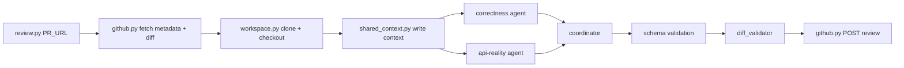

## Context

See `proposal.md` for motivation and scope. This design covers the local CLI implementation of Phase 1: a correctness sub-agent, an API-reality sub-agent, one coordinator, GitHub App auth, workspace setup, and review posting. The target user is a developer running the bot from their machine against a real GitHub PR.

## Goals / Non-Goals

**Goals:**

- Provide a single CLI command that reviews a PR end-to-end.
- Keep all GitHub App credentials local and out of the repository.
- Produce structured, diff-validated review output that GitHub accepts.
- Make the agent prompts and coordinator prompt easy to iterate on independently of the wiring code.
- Allow the bot to read files outside the diff when the agent explicitly needs context.

**Non-Goals:**

- Running as a persistent service or webhook handler.
- Multi-agent concurrency, risk tiers, or diff filtering beyond lockfiles.
- Re-reviews, break-glass overrides, or human approval gates.
- Integration with external orchestration, D1, R2, or Workers.
- Applying suggested fixes automatically.

## Components

```text
review.py (CLI)
  |
  v
github.py  ---->  GitHub App auth + PR fetch + review POST
  |
  v
workspace.py  ---->  clone + checkout PR branch
  |
  v
shared_context.py  ---->  assemble shared-context.md
  |
  +---> agents/correctness.py + prompts/correctness.md  ---->  JSON findings
  |
  +---> agents/api_reality.py + prompts/api-reality.md + provider contracts  ---->  JSON findings
  |
  v
coordinator.py + prompts/coordinator.md  ---->  filtered/rewritten findings
  |
  v
schema.py / schema.json  ---->  validate output
  |
  v
diff_validator.py  ---->  map findings to diff lines
  |
  v
github.py  ---->  POST review
```

| Component | Responsibility |
|---|---|
| `review.py` | CLI entrypoint; wires components and handles top-level errors. |
| `github.py` | App JWT minting, installation token exchange, PR metadata/diff fetch, review POST, bot-self-skip. |
| `workspace.py` | Clone repository into isolated path, checkout head SHA, optional cleanup. |
| `shared_context.py` | Write `shared-context.md` from PR metadata and validation results. |
| `agents/correctness.py` | Invoke the correctness agent with the shared context and filtered diff. |
| `agents/api_reality.py` | Invoke the API-reality agent with shared context, diff, and provider contract summaries. |
| `agents/provider_contracts.py` | Load and expose accurate GitHub, Linear, and Cloudflare contract summaries for the API-reality agent. |
| `coordinator.py` | Deduplicate, filter, rewrite, and assign final severity/verdict. |
| `schema.py` / `schema.json` | Validate agent and coordinator output against the review schema. |
| `diff_validator.py` | Verify that each `code_location` maps to a right-side diff line. |

## Data flow



1. CLI parses the PR URL and loads credentials from environment.
2. `github.py` mints an installation token, fetches metadata, and fetches the diff.
3. If the sender matches the bot username, the run exits successfully with no review.
4. `workspace.py` clones the repository and checks out the PR branch at the head SHA.
5. `shared_context.py` writes `shared-context.md` containing PR title, body, head/base SHA, changed files, and validation results.
6. The correctness agent and API-reality agent run concurrently.
   - The correctness agent reads `shared-context.md` and the diff and emits JSON findings for logic bugs, error paths, claim mismatches, and architecture-ordering bugs.
   - The API-reality agent reads `shared-context.md`, the diff, and provider contract summaries, and emits JSON findings for hallucinated or misused GitHub / Linear / Cloudflare APIs.
7. The coordinator reads findings from both agents, deduplicates by `(path, start_line, normalized_title)`, drops weak or contradicted items, and rewrites each remaining finding to one concrete issue.
8. `schema.py` validates the coordinator output.
9. `diff_validator.py` checks each `code_location` against the PR diff; attachable findings become inline comments, others move to the summary body.
10. `github.py` posts the review with the chosen `event`.

## Minimal data model

The review output schema is the shared contract between agents, coordinator, and GitHub posting:

```json
{
  "findings": [
    {
      "title": "<=80 chars",
      "body": "evidence + problem + failure scenario + suggested fix",
      "confidence_score": 0.85,
      "priority": 2,
      "code_location": {
        "absolute_file_path": "src/example.py",
        "line_range": {"start": 42, "end": 42}
      },
      "suggested_fix": {
        "description": "Add a None guard.",
        "replacement": "if payload is None:\n    return ..."
      }
    }
  ],
  "overall_correctness": "patch is correct" | "patch is incorrect",
  "overall_explanation": "one paragraph",
  "overall_confidence_score": 0.85,
  "status": "no_further_concerns" | "review_in_progress"
}
```

Priority mapping:

| Priority | Meaning | GitHub `event` |
|---|---|---|
| 0 / suggestion only | Style or minor improvement | `COMMENT` |
| 1 / warning | Potential correctness issue | `COMMENT` |
| 2 / critical | Production-safety or definite bug | `REQUEST_CHANGES` |

## Decisions

### 1. Use a local CLI instead of a server
A CLI avoids deployment, secrets management, and webhook handling in Phase 1. It lets us validate the review experience quickly. A server/webhook can be added in a later phase without changing the agent or coordinator prompts.

Alternative considered: start with a Worker webhook. Rejected because it adds Cloudflare and webhook-signature complexity before the core review loop is proven.

### 2. Keep credentials in environment variables
GitHub App ID, installation ID, private key path, and workspace root are read from environment variables or a local `.env` file. They are never committed.

Alternative considered: a configuration file. Rejected because environment variables are the standard local-secret pattern and keep the repo configuration-free.

### 3. Use two focused sub-agents and one coordinator in Phase 1
Split the work into a correctness agent (logic bugs, error paths, claim mismatches, architecture-ordering bugs) and an API-reality agent (hallucinated or misused GitHub / Linear / Cloudflare APIs). Smaller focused prompts are easier to tune and less likely to drift into each other's territory. The coordinator prompt handles deduplication and rewriting so the later multi-agent path reuses the same coordinator.

Alternative considered: one broad correctness agent covering everything. Rejected because it mixes provider-contract verification with code-bug hunting, making the prompt harder to stabilize.

### 4. Write shared context to a file
The CLI writes `shared-context.md` to the workspace so the agent prompt can reference it as a file instead of embedding large context in the prompt. This keeps prompts shorter and makes iteration easier.

Alternative considered: embed all context in the prompt. Rejected because it duplicates content and makes prompt tuning harder.

### 5. Validate diff lines before posting
A small diff parser maps each file to its right-side line numbers. This prevents the whole review from failing because one comment references a line that GitHub does not accept.

Alternative considered: rely on GitHub's error response. Rejected because one bad line can reject the entire review payload.

### 6. Use Python for the CLI and wiring
Python is a good fit for GitHub API clients, file operations, and agent orchestration. The agent itself can be driven by any model interface that accepts a prompt and returns JSON; the wiring code does not depend on a specific provider in Phase 1.

## Failure modes

| Failure | Handling |
|---|---|
| Invalid GitHub credentials | Fail fast before cloning. |
| PR not found or no access | Surface the GitHub API error and exit non-zero. |
| Clone or checkout fails | Surface the Git error and exit non-zero. |
| Agent returns invalid JSON | Schema validation fails; surface the error and exit non-zero. |
| Coordinator output fails schema validation | Surface validation errors and exit non-zero. |
| No findings attach to diff lines | Post all findings in the summary body with `COMMENT`. |
| GitHub rejects the review payload | Surface the provider error and exit non-zero. |
| Bot opens the PR | Exit successfully without posting. |

## Risks / Trade-offs

- **Agent output quality depends on the prompt.** → Keep prompts under version control, iterate on real PRs, and bias the coordinator toward dropping weak findings.
- **Reading files outside the diff can lead to scope creep.** → The prompt instructs the agent to read outside the diff only when needed to judge correctness.
- **Local workspace can grow large.** → Default cleanup is enabled; retention is opt-in for debugging.
- **GitHub App credentials are plaintext on the developer machine.** → Load from `.env` which is gitignored; never log tokens.
- **One bad line location can still reach the diff validator if the parser is wrong.** → Use a real diff from GitHub and test the validator against already-merged PRs.
- **API-reality agent depends on accurate provider contract summaries.** → Version the contract summaries with the project and update them when provider packages change. Ground every finding in the real provider docs.
- **Two agents can disagree.** → The coordinator resolves overlaps; contradicted findings are dropped unless one side has strong evidence.

## Migration plan

Phase 1 has no production deployment. The migration path is:

1. Create a GitHub App and install it on a test repository.
2. Configure `.env` with App ID, installation ID, and private key path.
3. Run the CLI against a real PR in the test repository.
4. Inspect the posted review and iterate on prompts.

Future phases will introduce a server, webhook handler, and persistence; they will reuse the same schema and prompts.
