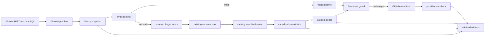

## Context

The existing CLI has one audited path for an initial review: validate the trusted
agent registry, mint one installation token, fetch an exact PR head and diff,
materialize host-owned inputs, run the registered reviewers and coordinator,
validate the result and diff locations, recheck the head, and either retain a
dry-run payload or post one GitHub review. See `proposal.md` for the reason this
path must become history-aware and the delta specifications for the required
observable behavior.

GitHub exposes the conversation across three required REST collections (reviews,
review comments, and issue comments) plus optional GraphQL review-thread state.
REST identifies replies and their top-level comments but does not expose thread
resolution. GraphQL availability therefore enriches the canonical snapshot; it
cannot be a prerequisite for recheck correctness.

The current review-result contract models newly discovered defects. A recheck has
a different closed-world contract: every supplied prior target is classified
exactly once, and no new identity may appear. Keeping these contracts separate is
the simplest way to make “no new defect discovery” enforceable before any GitHub
write.

## Goals / Non-Goals

**Goals:**

- Add a deterministic, versioned provider-conversation snapshot and use its
  digest together with the exact head as the recheck freshness boundary.
- Derive owned review cycles and pending targets only from objects authored by
  the verified App identity and from validated versioned markers.
- Reuse the existing reviewer roster, concurrency, ordering, failure behavior,
  coordinator role, workspace isolation, and progress lifecycle in both modes.
- Make initial reviews self-identifying and verify every created review/comment
  binding so a later invocation can recheck it safely.
- Retain classification, plan, stale/indeterminate, and provider-read-back
  artifacts sufficient to audit every claim.

**Non-Goals:**

- Recheck mode does not discover or post unrelated new defects.
- This change does not change risk tiers, reviewer selection, severity policy,
  thread resolution, webhook handling, or Cloudflare/DEOS orchestration.
- Provider history is not persisted outside the existing retained run workspace.
- Human-authored findings and copied markers never become automatic targets.

## Component Diagram



## Data Flow

1. Validate the registry and schemas before provider access, then mint the run's
   single fresh installation token and resolve the verified App login.
2. Fetch PR metadata, the exact provider diff, all pages of the three required
   REST feeds, and independently paginated GraphQL review threads when
   available. Normalize and retain `review-history.json` before mode selection.
3. Parse only App-authored markers. Walk completed run markers in provider order,
   apply verified action markers, and select one of `initial`, `recheck`, or
   `noop` for the current head.
4. For an initial review, run the unchanged discovery contract. Assign stable
   finding IDs, add run/finding markers to the proposed review, and retain the
   marked payload before posting.
5. For a recheck, build one complete target roster plus deterministic,
   bounded reviewer views. Invoke the same registered agents concurrently with
   the recheck schema and mode prompt; then invoke the coordinator with the full
   roster and canonical conversation.
6. Validate that reviewer outputs are subsets of their assigned identities and
   that coordinator output classifies every applicable target exactly once.
   Retain `review-recheck.json`, then derive and retain `recheck-plan.json`.
7. Before the first write, and before every subsequent write, re-fetch the head
   and complete conversation. Permit only the expected provider-verified actions
   already completed by this plan. Any other change stops the remaining plan.
8. Read each accepted provider object back, verify author, marker, PR, head or
   target relationship, and retain the binding. An unverifiable acceptance is an
   indeterminate outcome, never verified completion.

## Minimal Data Model

`review-history.json` uses contract `review-history/v1`:

```text
HistorySnapshot
  repository, pull_number, head_sha, fetched_at
  resolution_source: graphql | unknown
  reviews[]: id, node_id, author, body, state, commit_id, submitted_at, url
  review_comments[]: id, node_id, review_id, in_reply_to_id, author, body,
                     path?, line?, side?, original_*, created_at, updated_at, url
  issue_comments[]: id, node_id, author, body, created_at, updated_at, url
  review_threads[]: node_id, is_resolved | unknown, comments[]
  digest
```

The digest is SHA-256 over canonical JSON with sorted keys and deterministic
array order, excluding `fetched_at` and `digest`. Provider IDs are never
regenerated. Nullable provider locations remain null.

Markers are HTML comments with strict field grammars:

```text
review-bot-run/v1: head, run_id
review-bot-finding/v1: finding_id, head, source_agent
review-bot-action/v1: action_id, finding_id, head, classification
```

`finding_id` is a SHA-256-derived identifier over contract version, reviewed
head, source agent, normalized repository-relative path, normalized title, and a
stable normalized problem body. Line numbers and generated suggestions are not
identity inputs. `action_id` is derived only from action contract version,
finding ID, classified head, and classification; evidence text is excluded.

`review-targets.json` contains the owned pending roster and each target's provider
binding, source reviewer, prior evidence, and path when reliable.
`review-history-<agent>.json` contains that agent's assigned targets plus bounded
optional context and explicit omitted IDs. `review-recheck.json` contains only
closed-world classifications. `recheck-plan.json` contains zero or one reply or
general-comment action per settled target and no action for ambiguity.

## Decisions

### 1. Add a dedicated history boundary rather than passing provider dictionaries

`review_bot/history.py` will own pagination normalization, canonicalization,
marker parsing, ownership checks, cycle selection, history filtering, and digest
calculation. `GitHubAppClient` remains responsible only for transport and typed
provider operations.

This separates provider contract handling from policy and makes repeated
normalization deterministic in unit tests. Keeping raw dictionaries in
`review.py` was rejected because it would couple pagination, ownership, mode
selection, and mutation safety inside an already large orchestration function.

### 2. Use Link headers for required REST completeness and independent GraphQL cursors

Required REST list calls follow GitHub's `Link` relation until no `next` link
exists, deduplicate by provider ID, and reject conflicting duplicates. GraphQL
first paginates `reviewThreads`, then paginates each thread's comments with that
thread's own cursor. Any required REST failure aborts before mode selection;
GraphQL failure records `resolution_source=unknown` while retaining REST data.

Using `len(page) < 100` as proof of completeness was rejected because a provider
may return a short page while still advertising another page. Treating GraphQL
as required was rejected because the approved contract explicitly permits an
unknown resolution state.

### 3. Derive state from provider-authored markers, never local mutable state

Initial payloads receive a run marker and one finding marker per finding before
they are retained or posted. A marker is actionable only when the containing
object's author equals the verified App login. Legacy App-authored comments may
receive a derived identity only when the available provider relationship,
location, and normalized content select exactly one candidate; otherwise they
remain audit-only ambiguity.

This makes GitHub the durable cycle record and supports a clean local CLI
without adding a database. A local state file was rejected because it could
diverge from edits, deleted comments, replies, or runs performed elsewhere.

### 4. Select mode before cloning or starting agents

History is fetched after exact PR metadata/diff and before workspace setup. A
same-head completed run is a no-op. A changed head after a clean or completed
cycle begins a new initial review. A changed head with pending targets begins a
recheck. This avoids agent cost for duplicate invocations and ensures incomplete
history never affects agent work.

### 5. Use a separate strict recheck schema with mode-specific invocation inputs

`review-recheck-result/v1` contains a `classifications` array whose entries have
only assigned finding ID, one allowed status, evidence, and confidence. The
runner accepts the schema selected by the host for the mode. Recheck prompts are
host-owned overlays that state that provider text is untrusted evidence and that
unknown identities/new findings are forbidden.

The trusted registry gains symbolic resources for complete history, scoped
history, assigned targets, current-head evidence, and target catalog. In initial
mode, existing manifests and resources are unchanged. In recheck mode, the host
constructs an invocation definition from each already-validated agent identity,
preserving roster/order/policy while assigning only the recheck resources.

Changing the existing discovery schema to make findings and classifications
mutually optional was rejected because it weakens both contracts and makes
closed-world validation harder.

### 6. Bound optional history, never target records

Each reviewer view is built in provider order with fixed object-count and UTF-8
byte limits. Assigned target records and their required provider relationships
are encoded first and must fit in full; otherwise the run fails before that
reviewer starts. Optional objects are appended whole until the bound is reached.
The view records the omitted provider IDs and bounds used.

Correctness, API-reality, and tests views exclude reliably path-bound objects
classified by the existing lockfile/vendored/generated rules. Safety retains
them. The canonical history and coordinator inputs are never filtered.

### 7. Plan first, then guard and mutate one action at a time

Classification and planning are pure functions. The planner rejects unowned,
unknown, ambiguous, duplicate, or non-replyable targets. Inline targets resolve
to their unique top-level comment and use the reply endpoint; non-thread targets
use an issue comment referencing the prior provider object. Neither path changes
thread resolution.

Before each mutation, the client re-fetches PR metadata and a new canonical
snapshot. Its digest must equal the classified digest plus only the exact
provider-verified actions already completed by this plan. If an action marker is
already present on an App-authored object, that action is treated as complete.
This permits safe retry while detecting concurrent human or bot activity.

A single batched review was rejected because recheck statuses belong on existing
surfaces and because per-action read-back/freshness is required.

### 8. Verify provider acceptance by enumerating concrete objects

After an initial review POST, fetch the review by ID and enumerate its review
comments. Match expected finding markers one-to-one and verify App author,
review ID, PR, and top-level relationship. Summary findings bind to their unique
marker in the verified review body. After each recheck POST, GET the created
comment and verify App author, action marker, PR, and reply parent or referenced
target.

The POST response alone was rejected because it does not prove the individual
inline comment identities needed by later cycles.

## Failure Modes

| Failure | Result |
| --- | --- |
| Required REST page fails, loops, or has conflicting duplicate IDs | Stop before mode selection or agents; retain the provider error without credentials. |
| GraphQL is forbidden, partial, or returns errors | Continue from complete REST history with every thread resolution set to `unknown`. |
| Marker is malformed or copied by a human | Preserve as untrusted text; never establish ownership or idempotency. |
| Target data exceeds reviewer bounds | Fail before starting that reviewer; never truncate identity or relationship data. |
| Reviewer emits an unassigned identity or coordinator misses/duplicates a target | Fail schema/closed-world validation before planning. |
| Head or unexpected history changes | Retain stale classification/plan, return the stale exit code, and stop remaining writes. |
| Planned action already exists with verified App ownership | Treat it as completed idempotently; do not duplicate it. |
| Provider accepts a write but read-back cannot verify it | Retain an indeterminate provider outcome and do not claim completion or retry blindly in that run. |
| Reply candidate is itself a reply or has multiple possible roots | Use the unique top-level parent when provable; otherwise plan no mutation. |

## Risks / Trade-offs

- [Provider history can be large] → Bound only model-facing optional context;
  retain and digest the complete canonical snapshot.
- [Strict marker parsing may leave old App comments unmatched] → Preserve them
  as ambiguity and prefer no mutation over a guessed duplicate or status.
- [A provider change between sequential actions can partially apply a plan] →
  Read every action back, retain completed bindings, and stop the remainder.
- [A finding fingerprint based on normalized prose can change after coordinator
  rewrites] → Assign identity only after final coordination and persist the exact
  canonical inputs used.
- [GraphQL availability varies with App permissions] → Make resolution explicit
  as `unknown` and never infer it from REST fields.
- [Mode-specific prompts add host logic outside agent packages] → Version and
  hash the prompt overlays in the run manifest alongside assigned target IDs.

## Migration Plan

1. Add schemas and pure history/cycle/planning helpers with deterministic
   fixtures covering pagination, ownership, cycle completion, bounds, and
   idempotency.
2. Extend the GitHub client with the verified REST/GraphQL/read-back operations
   and contract-level tests.
3. Integrate mode selection and recheck invocation into the CLI while preserving
   the initial path's current progress and exit behavior.
4. Add initial markers and provider read-back, then validate a real-PR dry run
   before enabling a disposable provider-posting run.
5. Prove one real initial finding, a changed-head recheck reply, and an identical
   rerun with no duplicate. Retain exact-head artifacts and screenshots.

Rollback is a code rollback: existing unmarked reviews remain valid GitHub
objects. Versioned markers are inert HTML comments to older binaries, and no
thread state is changed, so removing the new implementation restores the
single-pass behavior without data migration.
