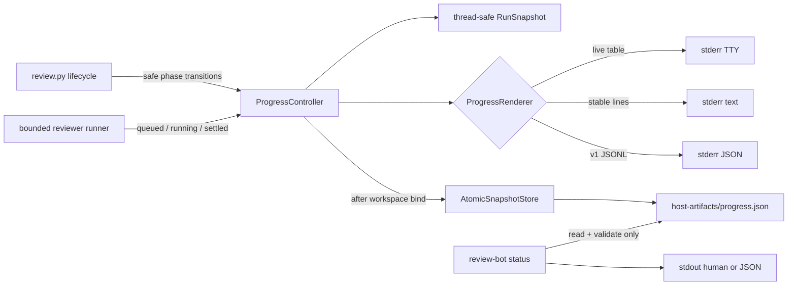
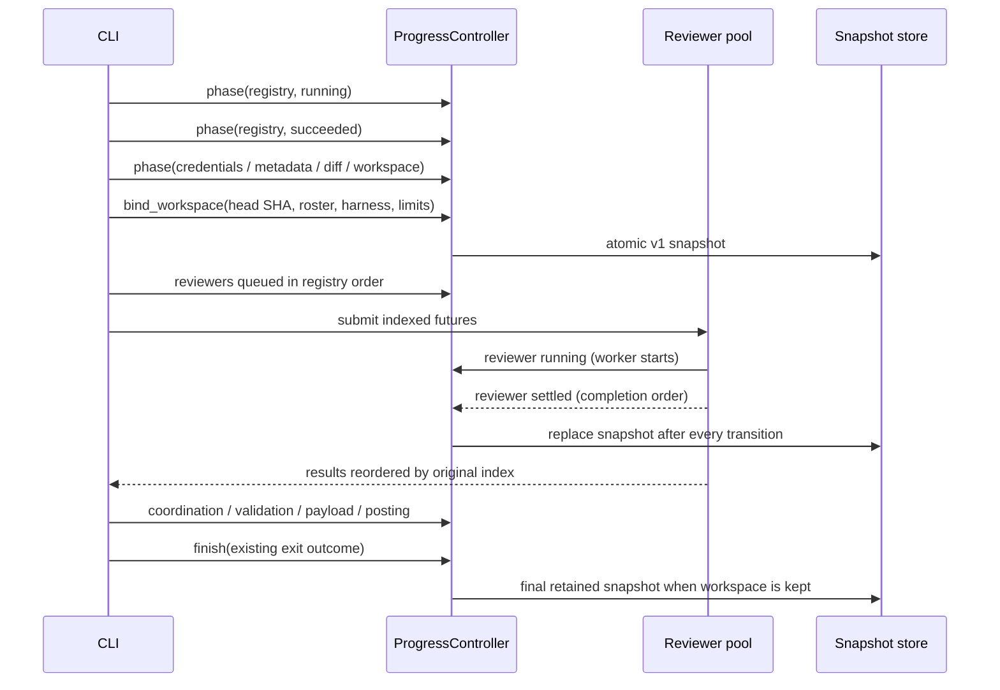

## Context

See [proposal.md](proposal.md) for motivation and
[the delta specification](specs/review-bot/progress-observability/spec.md) for
the observable contract.

The CLI currently owns the complete review lifecycle in `review_bot/review.py`.
It performs several provider and workspace operations before host artifacts
exist, then runs the registered reviewers through
`run_agents_concurrently()`. That runner uses `ThreadPoolExecutor.map()`, which
preserves result order but withholds every result until earlier futures have
settled. The CLI writes retained artifacts only after whole pipeline stages
finish and removes the PR workspace in a finalizer unless
`--keep-workspace` is selected.

The design must add observations around this existing behavior without putting
progress data into prompts, review payloads, provider requests, exit decisions,
or stdout. Progress may be emitted before a workspace exists, while durable
state can begin only after `host-artifacts/` exists and the exact provider head
SHA is known.

## Goals / Non-Goals

**Goals:**

- Keep one authoritative, thread-safe run state that drives stderr rendering,
  JSON events, and the retained snapshot.
- Report each pipeline and reviewer transition when it becomes true while
  retaining reviewer results in registry order.
- Make every persisted snapshot replace atomic and validate the same exact v1
  contract in the writer and the read-only `status` command.
- Restore terminal state and retain the last truthful state on handled
  interruption.
- Keep progress messages bounded and constructed only from explicitly safe
  metadata and classifications.

**Non-Goals:**

- Changing reviewer selection, prompts, model invocations, coordination,
  finding validation, GitHub requests, cleanup policy, or exit codes.
- Streaming model output, raw exception text, findings, repository content, or
  subprocess commands into progress.
- Persisting state outside the existing PR workspace, recovering after abrupt
  machine termination, or coordinating multiple simultaneous runs for the same
  PR workspace.
- Adding remote telemetry, a daemon, a web UI, percentages, or ETAs.

## Component Diagram



`ProgressController` is an observer owned by the CLI. The review pipeline does
not read progress state to decide what work to perform or what outcome to
return.

## Data Flow



Before workspace binding, the controller renders events but has no store. Once
`PRWorkspace.setup()` has created `host-artifacts/`, the CLI supplies the exact
repository, PR, head SHA, mode, harness, concurrency, reviewer roster, and
timeout values. The controller immediately writes the first complete snapshot;
it never writes a partial pre-binding schema.

## Minimal Data Model

`review_bot/progress.py` will define closed string enums for the specified
phases and states plus these internal records:

```text
ProgressEvent
  contract, run_id, sequence, recorded_at, elapsed_seconds
  phase, subject?, state, message, timeout_seconds?

WorkItemState
  name, state, started_at?, finished_at?
  elapsed_seconds, timeout_seconds, error_summary?

RunSnapshot
  contract, run_id, repository, pull_request, head_sha
  mode, harness, max_concurrency, overall
  started_at, updated_at, finished_at?
  reviewers[], coordinator?, final_exit_code?, review_url?
```

The serialized `RunSnapshot` matches
`review-progress-snapshot/v1` exactly. A packaged JSON Schema uses
`additionalProperties: false`, strict types, closed phase/state values, UTC
`Z` timestamps, and the required work-item shape. Both atomic writes and status
reads validate against that schema. Events are constructed from typed internal
values and serialized in one `json.dumps()` call per stderr line.

The controller uses `time.monotonic()` for elapsed durations and an injected UTC
clock for recorded timestamps. Wall-clock changes therefore cannot make
elapsed values negative. All event sequencing, model mutation, rendering, and
snapshot replacement occur under one re-entrant lock so worker callbacks cannot
interleave JSON lines or overwrite newer state with older state.

## Decisions

### 1. Put observation behind one controller with pluggable renderers

`ProgressController` exposes narrow operations: phase transition, roster bind,
work-item transition, workspace bind, provider review URL, and finalization.
The selected renderer is `RichProgressRenderer`, `PlainProgressRenderer`,
`JsonProgressRenderer`, or `NullProgressRenderer`. `auto` chooses Rich only
when stderr is a TTY; all renderers receive the same event and snapshot state.

Rich is added as an explicit runtime dependency. Its `Live` display renders a
pipeline line and registry-ordered work table, refreshes active elapsed values
from monotonic time, respects `NO_COLOR`, and is stopped in a controller
finalizer. Plain and JSON modes write and flush exactly one transition per
line. New progress never writes to stdout.

Alternatives considered:

- Scattered `print()` calls were rejected because they would duplicate state
  rules, make atomic retention inconsistent, and permit thread-interleaved JSON.
- Reusing logging was rejected because formatters and ambient handlers cannot
  guarantee the specified JSON-only stderr stream.
- A hand-built ANSI UI was rejected because terminal restoration, color
  capability, and live refresh are already handled by Rich.

### 2. Refactor lifecycle finalization without changing pipeline decisions

Argument parsing gains `--progress` with argparse `choices`, so an invalid value
fails before registry, credential, provider, or harness work. The outer
`run_review()` creates the controller and invokes an inner pipeline function
that retains the current operation order and return codes. The outer layer
records the returned exit code, handles `KeyboardInterrupt` long enough to mark
active work interrupted and stop Rich, then preserves the established
interruption behavior by re-raising it.

Pipeline operations are wrapped in small progress scopes that emit `running`
before the operation and one terminal state when its outcome becomes known.
Branches that deliberately omit later work emit `skipped`. The controller does
not catch or transform domain errors; the existing pipeline still prints its
existing diagnostics and selects its existing return code.

Cleanup remains last. With `--keep-workspace`, cleanup is reported skipped and
the finalized snapshot remains. Otherwise cleanup is reported running, the
snapshot store is detached before `PRWorkspace.remove()`, and the succeeded
event is terminal-only so progress cannot recreate a removed workspace.

Alternative considered: adding a progress call before every existing `return`
was rejected because missed branches would leave active phases and final exit
state inconsistent.

### 3. Replace `map()` with indexed futures and completion callbacks

`run_agents_concurrently()` accepts optional start and settlement callbacks.
It verifies every package before launch, reports the complete registry-ordered
roster queued, then submits indexed futures to the bounded executor. The worker
wrapper reports `running` only when a worker actually begins, so tasks waiting
behind the concurrency bound remain queued. The caller consumes
`as_completed()`, reports each success, failure, or timeout immediately, stores
the result at its original index, and returns the dense registry-ordered list.

Callback failures are isolated from review outcomes: controller callbacks are
designed not to raise for renderer I/O or persistence failures. Such observer
failures disable the affected renderer/store and emit at most a bounded warning
outside JSON progress mode. They never replace an agent result or reorder
coordination input.

Alternatives considered:

- Polling futures from the CLI would duplicate executor ownership and make
  launch state less accurate.
- Returning results in completion order would simplify reporting but would
  violate the stable coordinator and artifact contract.

### 4. Persist same-directory temporary files and replace atomically

After each bound-state transition, `AtomicSnapshotStore` serializes and
validates the complete snapshot, writes a unique temporary file in
`host-artifacts/`, flushes and fsyncs it, then calls `os.replace()` onto
`progress.json`. Same-directory replacement keeps the operation on one
filesystem. Temporary files are removed on failure and are ignored by status.

The writer is single-process/thread serialized by the controller. A new review
run retains the existing workspace setup behavior, which removes stale state
before cloning. There is deliberately no cross-process merge or lock: two
review runs targeting the same PR workspace are already incompatible with the
workspace replacement lifecycle.

Alternative considered: writing directly to `progress.json` was rejected
because readers could observe truncated JSON.

### 5. Make `status` a separate provider-free command path

`main()` dispatches `review-bot status` before the review path, just as it does
for cleanup. `run_status()` parses the PR URL and optional workspace root,
derives the existing PR-specific path through `workspace_dir_for()`, reads
`host-artifacts/progress.json`, validates the exact schema, and prints either a
stable human summary or the unchanged JSON object to stdout.

It does not instantiate the GitHub client, load `.env`, discover agents, build
a runner, call workspace setup/remove, or rewrite the file. Tests assert both
call isolation and file metadata/content stability.

Alternative considered: reconstructing status from process inspection or
individual artifact timestamps was rejected because neither has the required
contract nor a reliable final outcome.

### 6. Allow only curated progress text

Progress APIs do not accept arbitrary exception strings, model output, finding
bodies, repository paths, bootstrap tails, subprocess argv, or environment
values. Call sites choose bounded static classifications such as
`credentials unavailable`, `reviewer failed`, or `provider request failed` and
attach only explicitly permitted identity metadata (repository, PR, head SHA,
reviewer name, timeout, and provider review URL).

Reviewer `error_summary` records the safe failure class, not
`AgentResult.error`; the existing non-progress diagnostics remain unchanged.
The serializer enforces message length and rejects control characters. Tests
seed credentials, private-key paths, model text, repository content, and
subprocess arguments with sentinels and assert they are absent from stderr and
the snapshot.

Alternative considered: regex-redacting arbitrary exception text was rejected
because a denylist cannot prove repository or model content absent.

### 7. Verify equivalence before live proof

Deterministic tests compare `off`, plain, JSON, and auto modes using identical
fake provider and agent results. They assert identical stdout, review payload,
provider calls, non-progress artifacts, result order, exit code, and cleanup;
only stderr progress and `progress.json` may differ. Additional tests cover
schema rejection, atomic read races, queued-versus-running state, out-of-order
settlement, partial/all failures, status side-effect freedom, cleanup, and
handled interruption.

The implementation PR then receives a real no-post harness run against a real
PR at an exact head using the ignored `REVIEW_ENV_FILE` by reference. Retained
plain/JSON progress, the validated final snapshot, terminal/status screenshots,
and command/check summaries are committed under `evidence/`. Existing GitHub
App configuration and prior provider-originated review evidence remain clearly
separate from this feature's no-post proof; local progress proof is not labeled
as a new posted-review verification.

## Failure Modes

| Failure | Observable behavior | Review outcome |
| --- | --- | --- |
| Invalid progress mode | Argparse usage error before external work | Existing usage failure semantics |
| Failure before workspace creation | Terminal/stream terminal event only | Existing phase-specific exit code |
| Snapshot write/validation failure | Store disables itself; bounded safe observer warning where compatible | Pipeline continues unchanged |
| stderr closes or renderer fails | Renderer stops; retained state continues when available | Pipeline continues unchanged |
| One reviewer fails/times out | Reviewer settles immediately as failed/timed-out; others continue | Existing partial-failure contract |
| Every reviewer fails | All outcomes visible; later phases skipped | Existing exit code 3 |
| Coordinator/provider/validation failure | Active phase gets safe failed state; later work skipped | Existing matching exit code |
| `KeyboardInterrupt` | Active items and run marked interrupted; Rich stops; final snapshot retained if possible | Interrupt is re-raised |
| SIGKILL/machine loss | Last complete atomic snapshot remains | No fabricated final update |
| Invalid or absent status file | Clear read error; no provider/model/workspace mutation | Status returns non-zero |

## Risks / Trade-offs

- [Rich adds a runtime dependency and background refresh work] → Pin a minimum
  compatible version, keep plain/JSON independent, and exercise no-color and
  redirected streams in tests.
- [A single controller lock serializes renderer and fsync work] → Transitions
  are low-volume compared with provider/model work; favor deterministic ordering
  and atomicity over premature throughput optimization.
- [Observer I/O can fail while the review itself is healthy] → Fail the
  observer closed without changing the review result, and do not recursively
  emit progress about progress failure.
- [Monotonic elapsed values and wall-clock timestamps come from different
  clocks] → Inject both in tests and use each only for its intended field.
- [A process can die between state change and replacement] → The last complete
  snapshot remains valid and is intentionally not upgraded to a fabricated
  terminal state.
- [Evidence committed after a real run does not prove every future harness or
  terminal] → Record exact command, versions, target head, timestamps, and
  scope, and keep deterministic compatibility tests as the repeatable proof.

## Migration Plan

1. Add the progress model, schema, renderers, atomic store, and status reader
   behind tests.
2. Integrate indexed settlement callbacks in the reviewer runner while proving
   registry-ordered results unchanged.
3. Instrument the existing CLI phases and interruption/finalization boundary.
4. Add Rich and update operator documentation.
5. Run all deterministic checks and the real no-post exact-head harness proof;
   attach retained and visual evidence to the implementation PR.

No data migration is required. Older retained workspaces have no
`progress.json`; `status` reports that absence without mutation. Rollback is a
code/package rollback: old clients ignore and cleanup the new sibling artifact,
and no provider or remote state depends on it.
